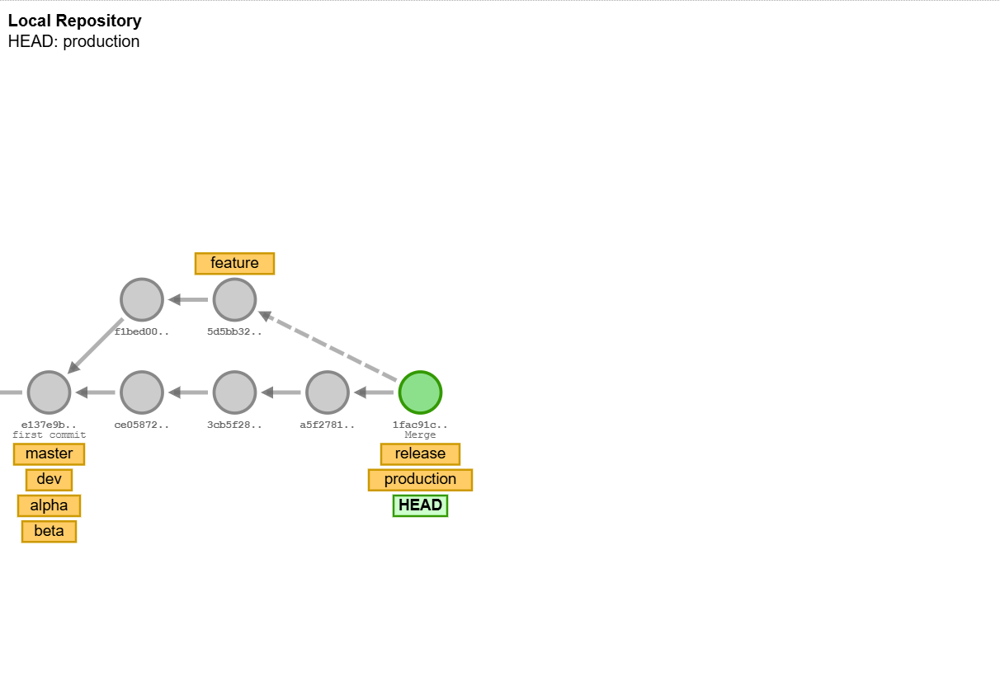

# Git-Training - Aman-Sir
## Introduction to Git and GitHub

### What is Git?
Git is a distributed version control system that allows multiple people to work on a project simultaneously without interfering with each other's changes. It helps track changes, revert to previous stages, and collaborate efficiently.

### What is GitHub?
GitHub is a web-based platform that uses Git for version control. It provides a collaborative environment for developers to host and review code, manage projects, and build software together.

### Basic Git Commands

#### Initialize a Repository
To start a new repository, navigate to your project directory and run:
```bash
git init
```

#### Clone a Repository
To clone an existing repository from GitHub:
```bash
git clone <repository-url>
```

#### Check Repository Status
To check the status of your files in the working directory and staging area:
```bash
git status
```

#### Add Files to Staging Area
To add specific files to the staging area:
```bash
git add <file-name>
```
To add all files:
```bash
git add .
```

#### Commit Changes
To commit the staged changes with a message:
```bash
git commit -m "your commit message"
```

#### View Commit History
To view the commit history:
```bash
git log
```

#### Create a New Branch
To create a new branch:
```bash
git branch <branch-name>
```

#### Switch to a Branch
To switch to an existing branch:
```bash
git checkout <branch-name>
```

#### Merge Branches
To merge a branch into the current branch:
```bash
git merge <branch-name>
```

#### Push Changes to Remote Repository
To push your changes to the remote repository:
```bash
git push origin <branch-name>
```

#### Pull Changes from Remote Repository
To pull the latest changes from the remote repository:
```bash
git pull origin <branch-name>
```

# Git Work Flow

## Workflow Details

### Centralized Workflow
In a centralized workflow, a single central repository serves as the main point of collaboration. All changes are committed to this central repository, and team members pull updates from it. This model is simple and easy to understand, making it suitable for small teams or projects with a straightforward development process.

**Advantages:**
- Simple and easy to manage.
- Clear history and linear progression of changes.
- Easier to enforce policies and permissions.

### Decentralized Workflow
In a decentralized workflow, multiple repositories are used, and each team member has their own repository. Changes are shared between repositories through a series of pull requests or patches. This model is more complex but offers greater flexibility and scalability, making it suitable for larger teams or projects with complex development processes.

**Advantages:**
- No single point of failure.
- Greater flexibility for parallel development.
- Scalable for large teams and complex projects.

Here are some common Git commands used in branching and merging in workflow:

### Create branches
```bash
git branch development
git branch production
git branch alpha
git branch beta
```

### Switch to the production branch
```bash
git checkout production
```

### Switch to the feature branch
```bash
git checkout feature
```

### Make commits on the feature branch
```bash
git commit -m "design"
git commit -m "backend"
```

### Switch to the development branch
```bash
git checkout development
```

### Merge the feature branch into development
```bash
git merge feature
```

### Commit the merge
```bash
git commit -m "feature test done"
```

### Create additional branches
```bash
git branch production
git branch dev
git branch alpha
git branch beta
```

### Switch to the production branch
```bash
git checkout production
```

### Switch to the feature branch
```bash
git checkout feature
```

### Create the feature branch and make a commit
```bash
git branch feature
git commit -m "feature-1"
```

### Make additional commits
```bash
git commit
git checkout feature
git commit
git commit
```

### Switch to the production branch
```bash
git checkout production
```

### Attempt to switch to the release branch
```bash
git checkout release
```

### Create and switch to the release branch
```bash
git checkout release -b
```

### Create the release branch from production
```bash
git checkout -b release production
```

### Make a commit
```bash
git commit
```

### Merge the feature branch into release
```bash
git merge feature
```

### Switch to the production branch
```bash
git checkout production
```

### Merge the release branch into production
```bash
git merge release
```

### Screenshots


# Creating and Managing a Pull Request on GitHub

#### Step 1: Create a New Repository
1. Go to GitHub and log in to your account.
2. Click on the `+` icon in the top-right corner and select `New repository`.
3. Name your repository (e.g., `pull-request-practice`).
4. Choose `Public` or `Private` as per your preference.
5. Click `Create repository`.

#### Step 2: Clone the Repository Locally
1. Open your terminal or command prompt.
2. Clone the repository to your local machine:
    ```bash
    git clone https://github.com/smitDankhraInventyv/Git-Training---Aman-Sir
    cd pull-request-practice
    ```

#### Step 3: Create a New Branch
1. Create a new branch called `feature`:
    ```bash
    git checkout -b feature
    ```
2. Add a new file (e.g., `example.txt`) to the branch:
    ```bash
    echo "This is a feature branch" > example.txt
    ```
3. Commit the changes:
    ```bash
    git add example.txt
    git commit -m "Add example.txt to feature branch"
    ```
4. Push the branch to GitHub:
    ```bash
    git push origin feature
    ```

#### Step 4: Set Up Branch Protection Rules
1. Go to your repository on GitHub.
2. Click on `Settings` > `Branches`.
3. Under `Branch protection rules`, click `Add rule`.
4. In the `Branch name pattern` field, enter `feature`.
5. Enable the following options:
    - `Require a pull request before merging`
    - `Require approvals` (set the number of required approvals to 2)
    - `Dismiss stale pull request approvals when new commits are pushed`
6. Click `Create`.

#### Step 5: Create a Pull Request
1. Go to the `Pull requests` tab in your repository.
2. Click `New pull request`.
3. Set the base branch to `main` and the compare branch to `feature`.
4. Add a title and description for your PR.
5. Click `Create pull request`.

#### Step 6: Simulate Approvals
1. Share the repository with a collaborator or use a second GitHub account to simulate approvals.
2. Ask the collaborator to review the PR and approve it.
3. Once 2 approvals are received, the PR can be merged.

#### Step 7: Merge the Pull Request
1. After 2 approvals, click `Merge pull request`.
2. Confirm the merge by clicking `Confirm merge`.
3. Delete the `feature` branch (optional).

#### Step 8: Verify the Changes
1. Switch back to the `main` branch locally:
    ```bash
    git checkout main
    ```
2. Pull the latest changes:
    ```bash
    git pull origin main
    ```
3. Verify that the `example.txt` file is now in the `main` branch.

## Screenshots
### 1- set rules for pull request


### 2 - in feature branch rules are created


### 3 - chcke request code 


### 4 - merge pull request


### 5 - request added into the feature branch


