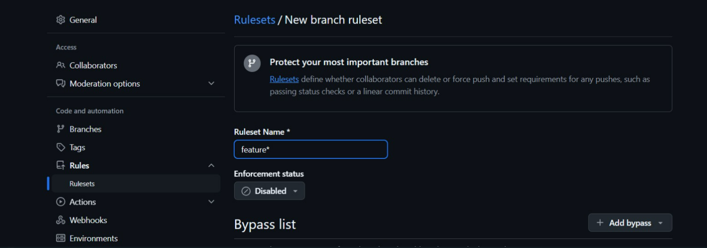
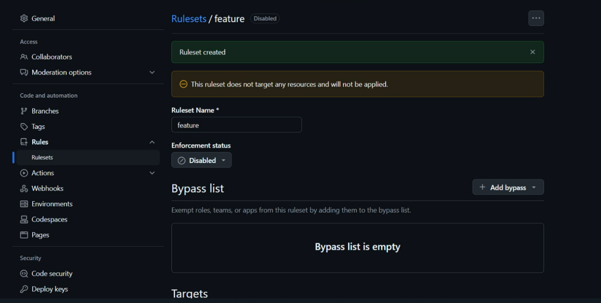
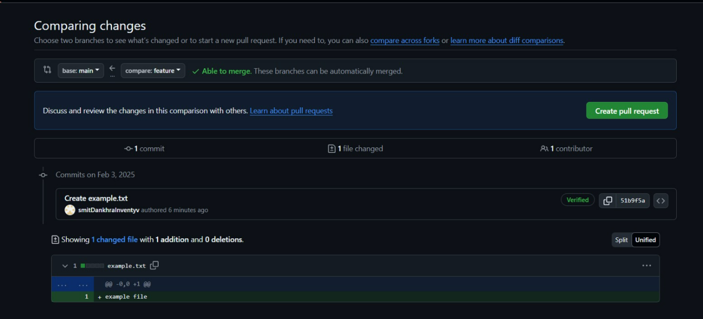
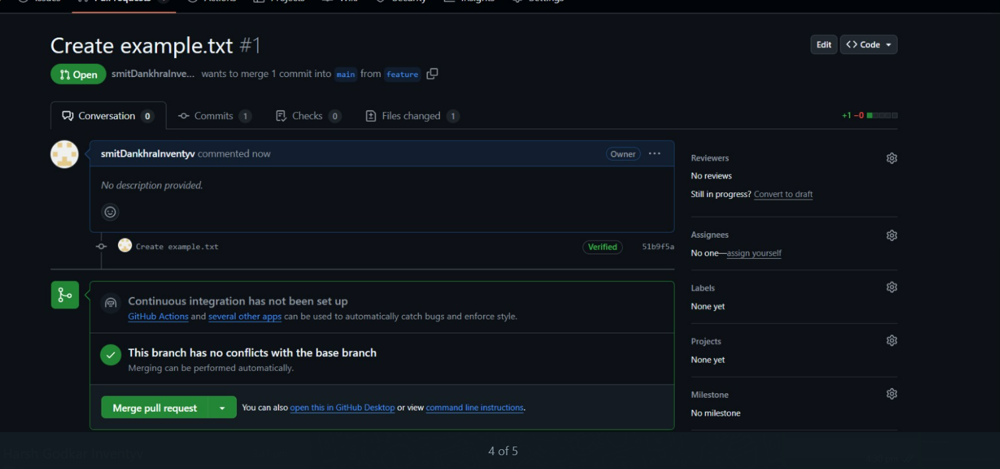
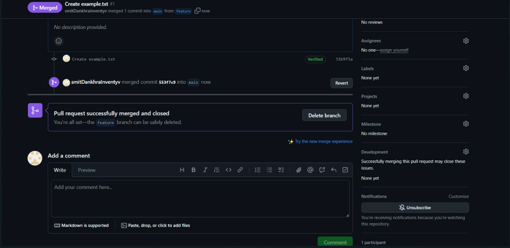

# Git-Training---Aman-Sir

# Git Token

### Git Credentials Token is Already Set 

# Git work flow

### commands

```
git branch devlopment
git branch production
git branch alpha
git branch beta
git checkout production
git checkout feature
Cannot find commit: feature
git brranch feature
I don't understand that.
git branch feature
git checkout feature
git commit -m "design"
git commit -m "backend"
git checkout development
Cannot find commit: development
git checkout devlopment
git merge feature
You have performed a fast-forward merge.
git commit -m "feature test done"
git checkout featrue
Cannot find commit: featrue
git checkout feature
Have fun!
git branch production
git branch dev
git branch alpha
git branch beta
git checkout production
git checkout feature
Cannot find commit: feature
git branch feature
git commit "feature-1"
git commit
git checkout feature
git commit
git commit
git checkout production
git checkout release
Cannot find commit: release
git checkout release -b
fatal: Not a valid object name:'release'
git checkout -b release produciton
fatal: Not a valid object name:'produciton'
git checkout -b release production
git commit
git merge feature
git checkout production
git merge release
You have performed a fast-forward merge.
```


# git branching 





